<h1 align="center">I Can't Draw</h1>
<p align="center"><b>You can't draw. Now you don't have to.</b></p>

**You type**

```
> how does a RAG chatbot answer a question?
```

**You get**

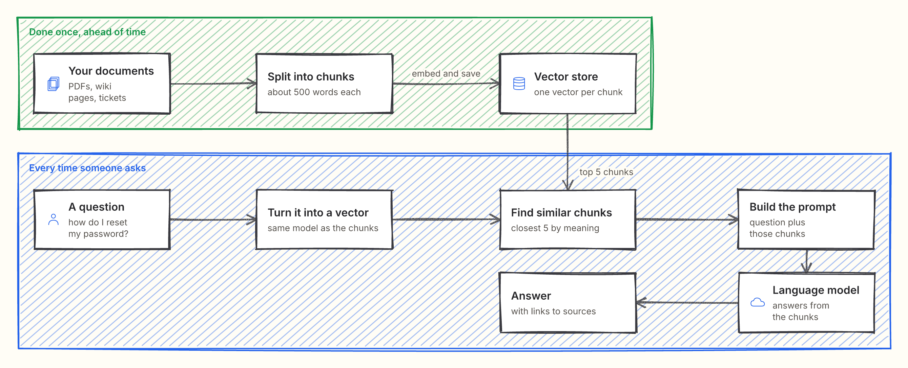

## Install

```
npx skills add PrabhjotSodhi/i-cant-draw
```

This works with Claude Code, Codex, Cursor, OpenCode and other coding agents that read skill folders. In Claude Code you can also install it as a plugin:

```
/plugin marketplace add PrabhjotSodhi/i-cant-draw
/plugin install i-cant-draw@i-cant-draw
```

Then ask for any diagram, in plain words.

## Use it to

### 1. Learn how anything works

Ask about something you half understand. Get the picture, not a wall of text.

```
> how does a coding agent fix a failing test?
```

<p align="center">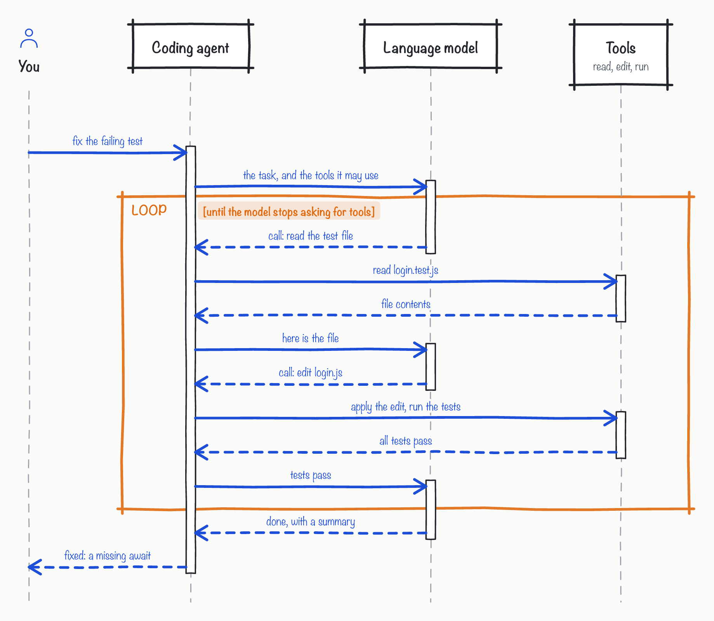</p>

### 2. Map any codebase

Point it at a repo and see how the pieces fit. This one is I Can't Draw, drawn by itself.

```
> draw how this repo works
```

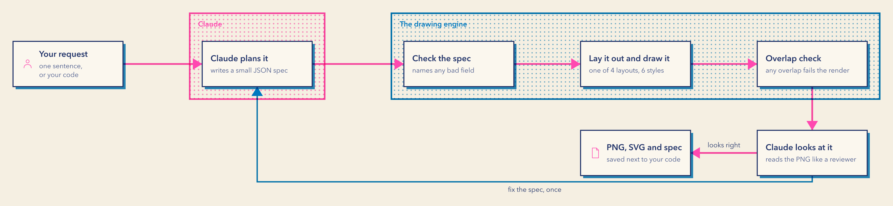

### 3. Show your design

HLDs and LLDs need diagrams. Describe the system once and get the big picture, the request step by step, and every status an order can be in.

```
> design checkout for my shop: the HLD, the order flow and the order statuses
```

**High-level design**


**Placing an order, step by step**

<p align="center">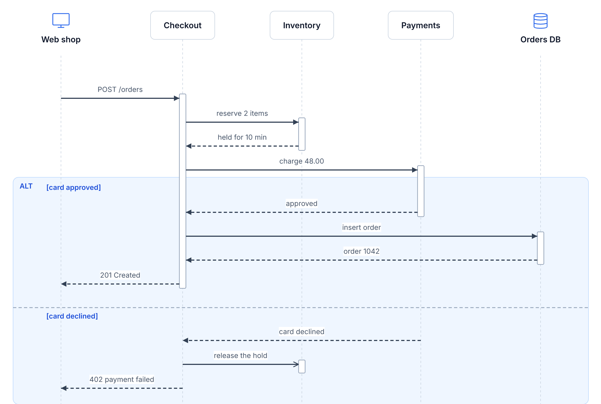</p>

**Every status an order can be in**

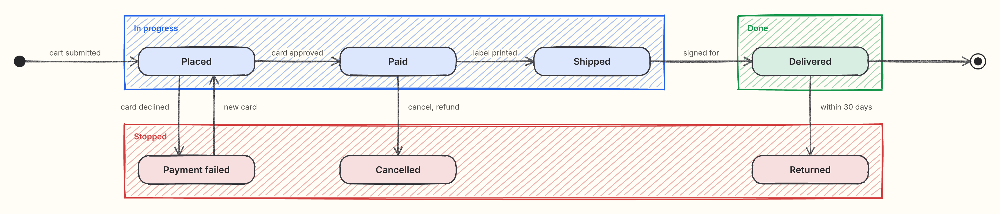

### 4. Think an idea through

Draw it before you build it. Gaps show up once you can see the whole thing.

```
> plan a multi-agent research assistant
```

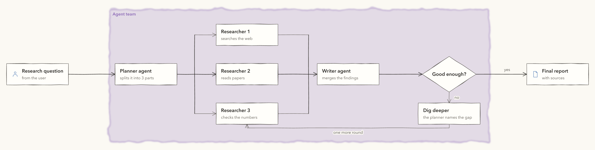

## Six styles

The same checkout design in every style. Name one when you ask.

| Crayon, the default | Risograph |
| --- | --- |
| 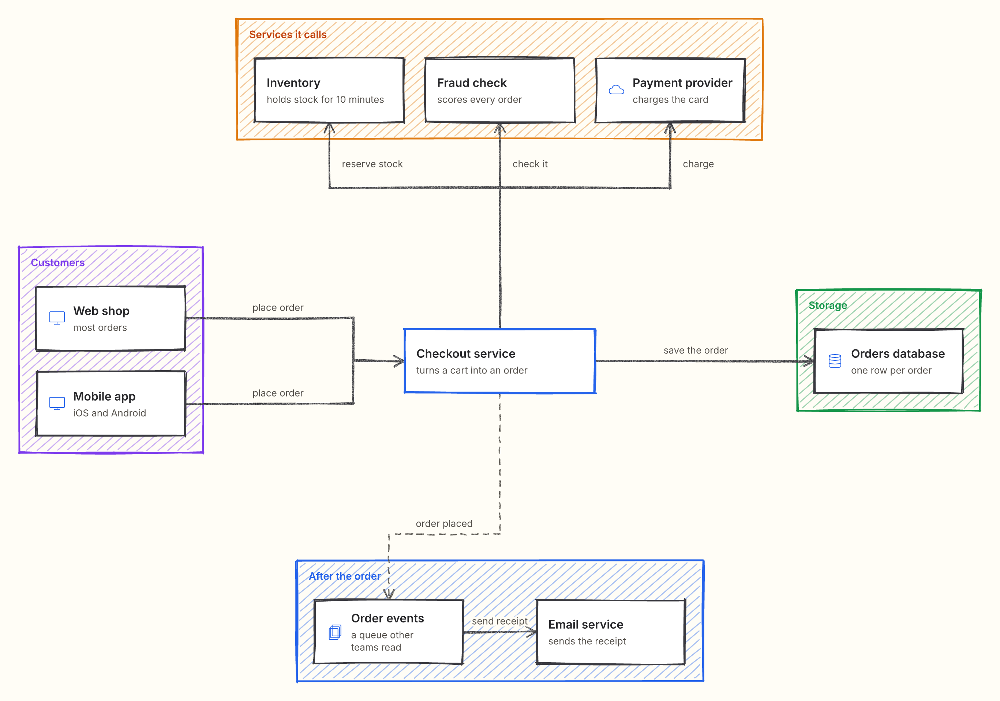 | 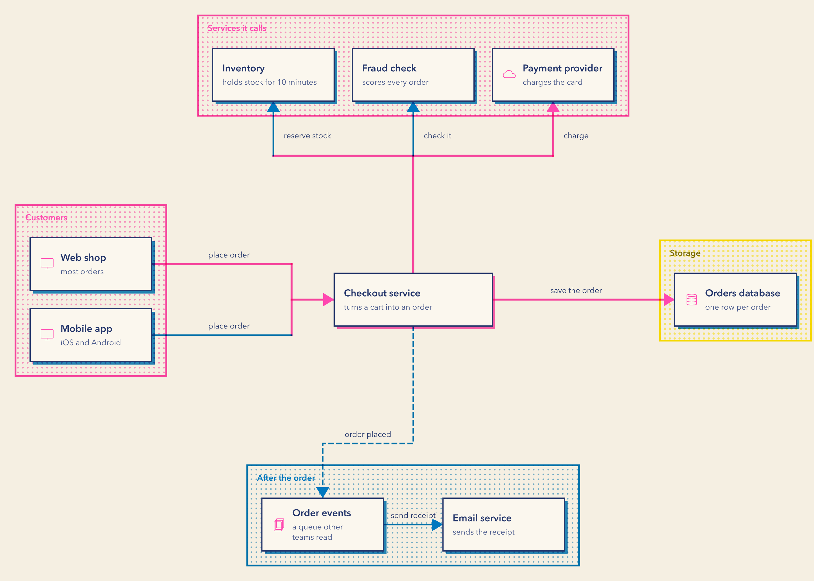 |
| **Whiteboard** | **Notebook** |
| 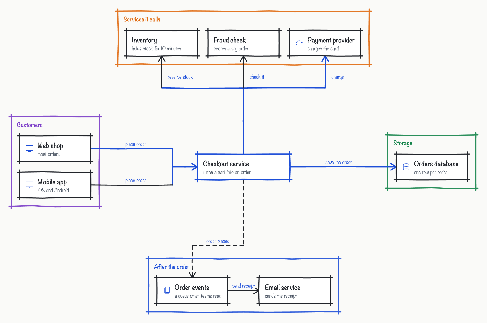 | 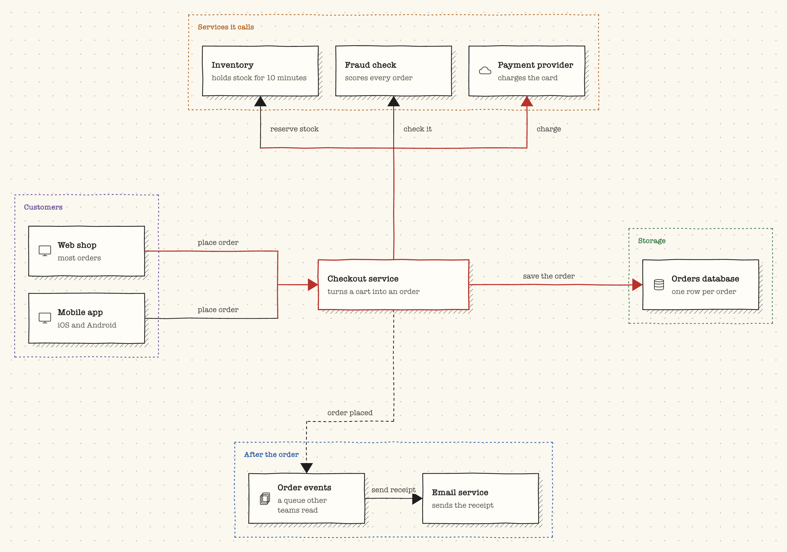 |
| **Watercolour** | **Quiet** |
| 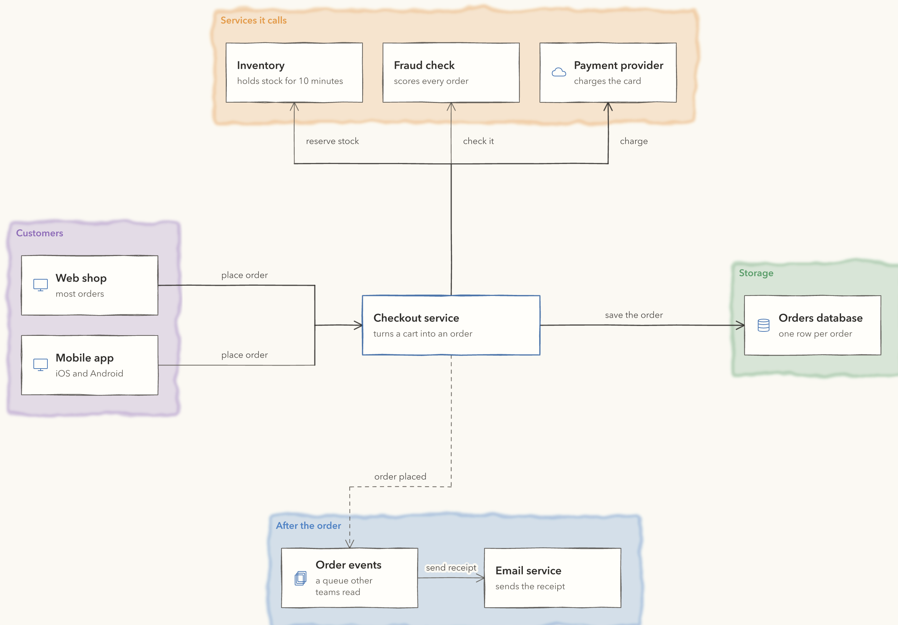 | 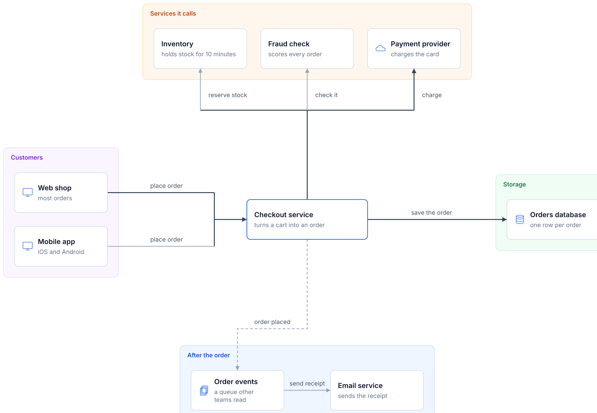 |

## Six layouts

- **Flow:** pipelines and processes, read left to right.
- **Hub:** one system in the middle and everything it talks to.
- **Sequence:** who sends what to whom, in order.
- **State machine:** the statuses one thing moves through.
- **Database schema:** tables, their columns, and which columns link.
- **Class diagram:** the classes in your code and how they relate.

Your agent picks the layout that fits what you asked.

```
> draw the database for an online shop
```

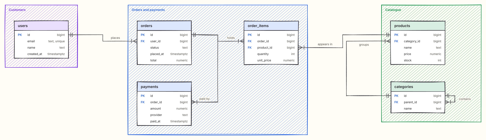

```
> draw the classes for orders and payments
```

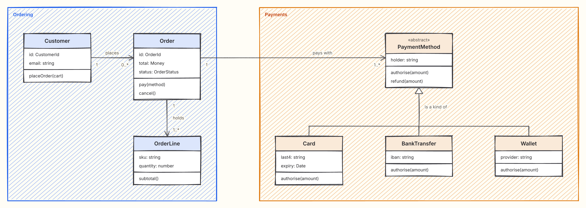

## Why not Mermaid or draw.io?

| | I Can't Draw | Mermaid | draw.io |
| --- | --- | --- | --- |
| You write | One sentence | Diagram code | Nothing. You drag boxes |
| Layout | Lined up on a grid. An overlap fails the render, and your agent fixes it | Automatic, and gets tangled as it grows | By hand |
| Look | Six hand-made styles | A few built-in themes | Stencils and shapes |
| Change it later | Edit the spec. The rest of the picture stays put | Edit the code | Drag boxes again |

## Requirements

- A coding agent that reads skill folders, such as Claude Code, Codex, Cursor or OpenCode.
- Node 18 or later.
- macOS for the risograph, whiteboard, notebook and watercolour fonts. Elsewhere those styles draw in Inter.

## Licence

MIT. See `LICENSE`. The Inter font is under the SIL Open Font Licence, in `skills/i-cant-draw/references/fonts/LICENSE.txt`.
